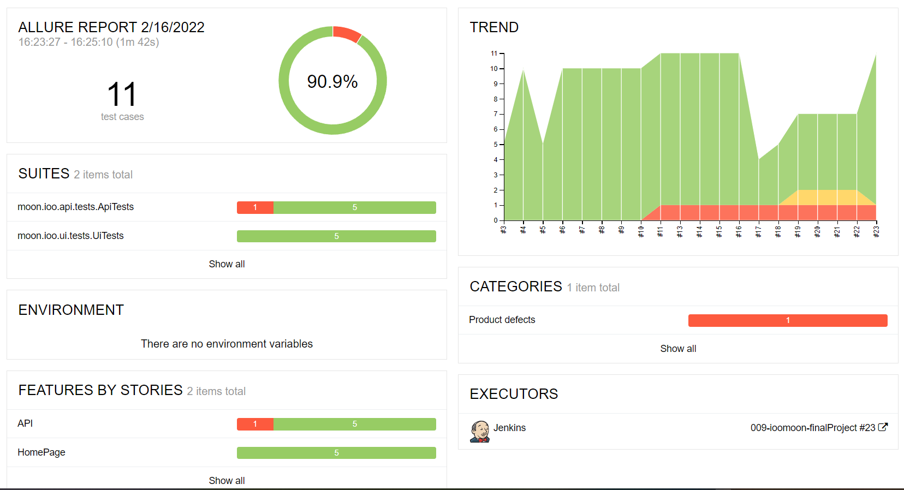
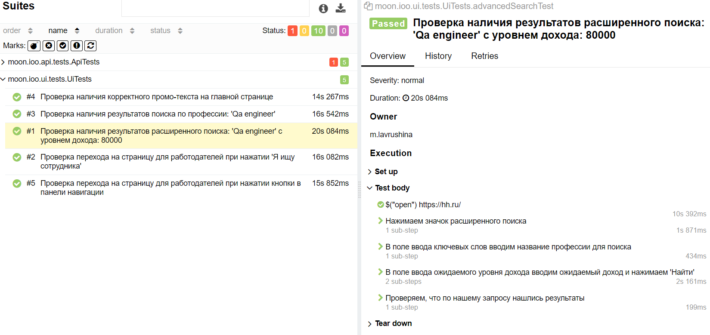

# Проект автотестов на [hh.ru](https://hh.ru/)


---

##  Реализованы проверки:

Ui:
- Проверка наличия корректного промо-текста на главной странице
- Проверка наличия результатов поиска по профессии
- Проверка наличия результатов расширенного поиска
- Проверка перехода на страницу для работодателей при нажатии кнопки в панели навигации
- Проверка перехода на страницу для работодателей при нажатии 'Я ищу сотрудника'

API:
- Проверка наличия результата поиска по работодателям на территории России
- Проверка корректного поиска компании по id
- Проверка на наличие открытых вакансий в HH.ru
- Проверка доступных локалей для хоста hh.ru
- Проверка доступных локалей для хоста hh.kz
- Поиск работодателя 'QA-guru'

---
##  Стек технологий:


##  Запуск проекта:
- для запуска проектов локально необходимо в local.properies определить параметры конфигурации
- для запуска проектов удаленно необходимо в remote.properies определить параметры конфигурации или передать значения:

  * browser (default chrome)
  * browserVersion (default 91.0)
  * browserSize (default 1920x1080)
  * remoteDriverUrl (url address from selenoid or grid)
  * allure_notifications_version (default 2.2.3)
  * comment (for Allure notifications)


Локально:
```bash
gradle clean test
```

Удаленно:
```bash
gradle clean -DremoteDriverUrl=https://%s:%s@selenoid.autotests.cloud/wd/hub/ -DvideoStorage=https://selenoid.autotests.cloud/video/ -Dthreads=1 test
```
##  Отчеты в Allure Report




##  Telegram-уведомления о прохождении тестов


:heart: <a target="_blank" href="https://qa.guru">qa.guru</a><br/>
:blue_heart: <a target="_blank" href="https://t.me/qa_automation">t.me/qa_automation</a>
